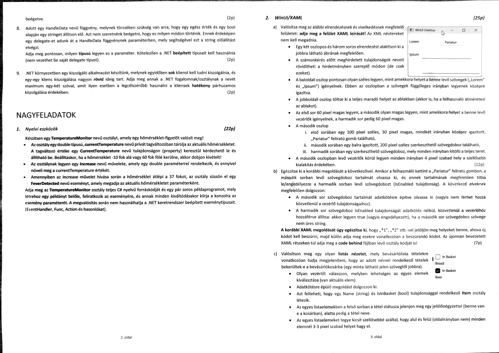

```xml
<Grid>
    <RowDefinitions>
        <RowDefinition Height="60"/>
        <RowDefinition Height="auto"/>
        <RowDefinition Height="60"/>
    </RowDefinitions>

    <ColumnDefinitions>
        <ColumnDefinition Width="auto"/>
        <ColumnDefinition Width="*"/>
    </ColumnDefinitions>

    <TextBlock Grid.Row="0" Grid.Column="0" VerticalAlignment="Center">Lorem</TextBlock>
    <TextBlock Grid.Row="1" Grid.Column="0" VerticalAlignment="Center">Ipsum</TextBlock>

    <Button
        Click="Pariatur_Click"
        Grid.Row="0"
        Grid.Column="1"
        Width="100"
        Height="30"
        VerticalAlignment="Center"
        HorizontalAlignment="Center"
        Margin="4 4 4 4">
        Pariatur</Button>
    <TextBox 
        Text="{x:Bind textValtozo, Mode=TwoWay}"
        Grid.Row="1"
        Grid.Column="1"
        Width="200"
        Margin="4 4 4 4"
        HorizontalAlignment="Left"></TextBox>
    <TextBox
        x:Name="AlsoText"
        Grid.Row="2"
        Grid.Column="1"
        HorizontalAlignment="Stretch"
        VerticalAlignment="Stretch"
        Margin="4 4 4 4"></TextBox>
</Grid>
```

```csharp
public class MainWindow : Window
{
    public string textValtozo {get;set;} = "";

    public MainWindow() this.InitializeComponent();

    public void Pariatur_Click(object sender, RoutedEventArgs e)
    {
        if(textValtozo != "") AlsoText.IsEnabled = true;
        else AlsoText.IsEnabled = false;
    }
}
```
```xml
<ListView>
    <ListView.ItemTemplate>
        <DataTemplate x:DataType="local:Item">
            <StackPanel Margin = "0,3,0,3">
                <CheckBox IsChecked="{x:Bind IsInBasket, Mode=TwoWay}" Content="In Basket"/>
                <TextBlock Text="{x:Bind Name}"/>
            </StackPanel>
        </DataTemplate>
    </ListView.ItemTemplate>
</ListView>
```