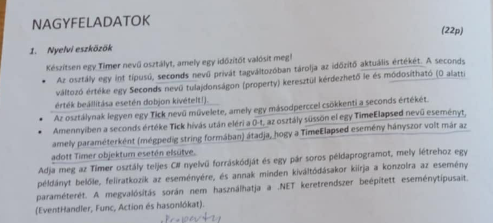

```csharp
public delegate void TimerEvent(string s);

class Timer
{
    private int seconds;
    public int Seconds{
        get {return seconds;}
        set {
            if (value < 0) throw new Exception("kisebb mint 0");
            seconds = value;
        }
    }
    private int eventCalledCount = 0;

    public event TimerEvent TimeElapsed;

    public void Tick()
    {
        seconds--;
        if(seconds <= 0)
        {
            eventCalledCount++;
            TimeElapsed?.Invoke(""+eventCalledCount);
        }
    }
}

class Program
{
    static void Main(string[] args)
    {
        TimerEvent te = (count) => {Console.WriteLine("count: " + count);};
        Timer timer = new Timer();
        timer.Seconds = 1;
        timer.TimeElapsed += te;
        timer.Tick();
    }
}
```