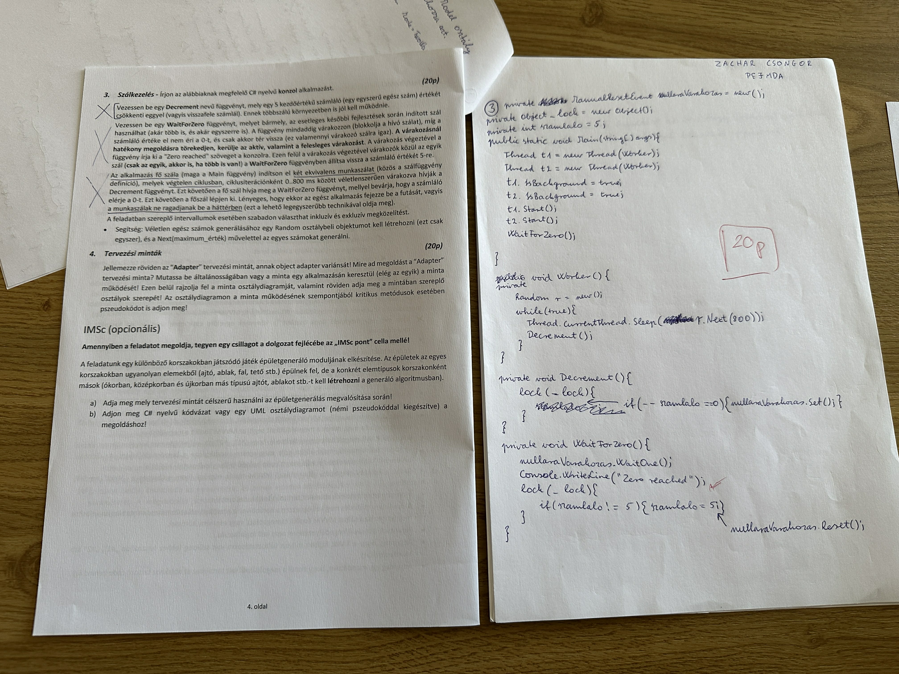

```csharp

class Program
{
    static int counter = 5;
    static bool reset = false;
    static object locker = new object();
    static ManualResetEvent mre = new ManualResetEvent(false);
    static Random r = new Random();
    static void Main(string[] args)
    {
        Thread t1 = new Thread(TimerThread);
        Thread t2 = new Thread(TimerThread);
        t1.IsBackground = true;
        t2.IsBackground = true;
        t1.Start();
        t2.Start();
        WaitForZero();
    }

    static void TimerThread()
    {
        while(true)
        {
            Decrement();
            Thread.Sleep(r.Next(0,800));
        }
    }

    static void Decrement()
    {
        lock(locker)
        {
            counter--;
            if (counter == 0) mre.Set();
        }   
    }

    static void WaitForZero()
    {
        mre.WaitOne();
        Console.WriteLine("Zero reached");
        lock(locker)
        {
            if(counter == 0)
            {
                counter = 5;
                mre.Reset();
            }
        }
        
    }
}

```